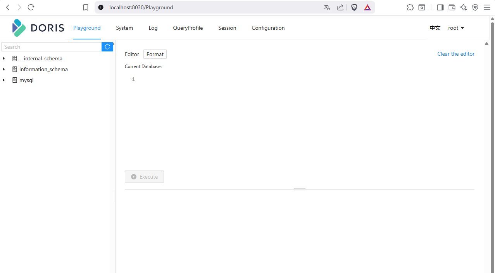
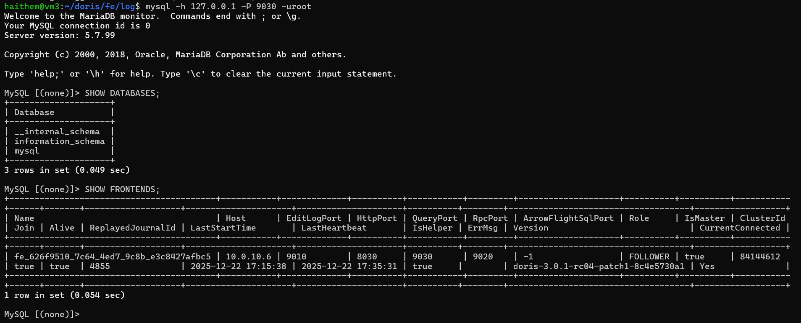

# Apache Doris Frontend Installation and Configuration

This guide documents the installation and configuration of Apache Doris 3.0.1 Frontend on a virtual machine (VM4).

## 0. Prerequisites (VM4)

### 0.1 System Update
```bash
sudo apt update && sudo apt upgrade -y
```

### 0.2 Java 17 Installation (REQUIRED for Doris 3.x)
```bash
sudo apt install openjdk-17-jdk -y
```

**Verify installation:**
```bash
java -version
```

**Expected output:**
```
openjdk version "17.x"
```

### 0.3 Set JAVA_HOME

Locate Java path:
```bash
readlink -f /usr/bin/java | sed "s:/bin/java::"
```

Configure environment variable:
```bash
echo 'export JAVA_HOME=/usr/lib/jvm/java-17-openjdk-amd64' >> ~/.bashrc
source ~/.bashrc
```

### 0.4 System Optimization (CRITICAL)
```bash
sudo sh -c "echo '* soft nofile 1000000' >> /etc/security/limits.conf"
sudo sh -c "echo '* hard nofile 1000000' >> /etc/security/limits.conf"
sudo sh -c "echo 'vm.max_map_count=2000000' >> /etc/sysctl.conf"
sudo sysctl -p
```

### 0.5 Time Synchronization
```bash
sudo apt install chrony -y
sudo systemctl enable chrony
sudo systemctl start chrony
sudo systemctl status chrony
```

## 1. Download Apache Doris 3.x
```bash
cd ~
wget https://apache-doris-releases.oss-accelerate.aliyuncs.com/apache-doris-3.0.1-bin-x64.tar.gz
tar -xzvf apache-doris-3.0.1-bin-x64.tar.gz
mv apache-doris-3.0.1-bin-x64 doris
```

## 2. Frontend Configuration (VM3)

### 2.1 Edit Configuration File
```bash
cd ~/doris/fe
nano conf/fe.conf
```

**Content to add/verify in `fe.conf`:**
```bash
CUR_DATE=`date +%Y%m%d-%H%M%S`

# Log dir
LOG_DIR = ${DORIS_HOME}/log

# For jdk 17, this JAVA_OPTS will be used as default JVM options
JAVA_OPTS_FOR_JDK_17="-Djavax.security.auth.useSubjectCredsOnly=false -Xms768m -Xmx768m -XX:+HeapDumpOnOutOfMemoryError -XX:HeapDumpPath=$LOG_DIR -Xlog:gc*:$LOG_DIR/fe.gc.log.$CUR_DATE:time,uptime:filecount=10,filesize=50M --add-opens=java.base/java.nio=ALL-UNNAMED --add-opens=java.base/jdk.internal.ref=ALL-UNNAMED"

# Set your own JAVA_HOME
JAVA_HOME=/usr/lib/jvm/java-17-openjdk-amd64

# store metadata, must be created before start FE.
# Default value is ${DORIS_HOME}/doris-meta
meta_dir = ${DORIS_HOME}/doris-meta

http_port = 8030
rpc_port = 9020
query_port = 9030
edit_log_port = 9010
arrow_flight_sql_port = -1

priority_networks=10.0.10.0/24
```

### 2.2 Start Frontend

**Start the service:**
```bash
~/doris/fe/bin/start_fe.sh --daemon
```

**Stop the service:**
```bash
~/doris/fe/bin/stop_fe.sh
```

## 3. Verification

### 3.1 Web Interface

Access the web interface via browser:
```
http://localhost:8030
```

**Login credentials:**
- Username: `root`
- Password: (empty)



### 3.2 SQL Connection

**Install MariaDB client:**
```bash
sudo apt update && sudo apt install -y mariadb-client
```

**Connect to Frontend:**
```bash
mysql -h 10.0.10.7 -P 9030 -uroot
```

**Verify Frontends:**
```sql
SHOW FRONTENDS;
```



## Important Notes

- Apache Doris 3.x requires Java 17 (mandatory)
- System optimizations (file limits and max_map_count) are critical for proper operation
- Priority network is configured for subnet `10.0.10.0/24`
- Default web interface port is `8030`
- Default SQL query port is `9030`
